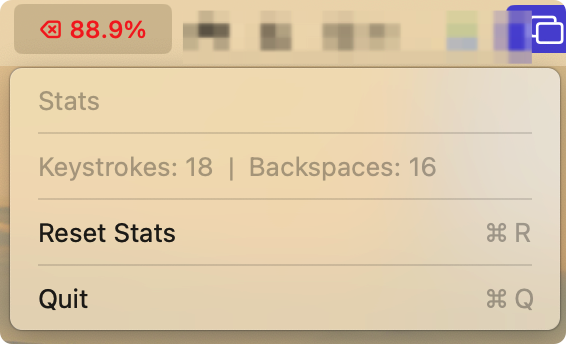

# TypeRight (BackspaceMonitor)

A native macOS Menu Bar app to improve typing efficiency by tracking your "Backspace Ratio" and providing feedback when excessive backspacing occurs.



## Features

- **Menu Bar Only**: Lives exclusively in the status bar—no Dock icon
- **Real-time Backspace Ratio**: Displays `⌫ X.X%` with color coding:
  - 🟢 Green: < 5% (excellent)
  - 🟠 Orange: 5-10% (moderate)
  - 🔴 Red: > 10% (high)
- **Burst Detection**: Detects "rage deleting" (5+ backspaces in 10 seconds)
- **Alert Feedback**: Visual HUD, haptic feedback, and sound when triggered
- **Privacy First**: No keylogging—only counts keystrokes

## Requirements

- macOS 13.0+
- Accessibility Permissions (required for global keyboard monitoring)

## Setup in Xcode

### 1. Disable App Sandbox
The app requires `CGEvent.tapCreate` for global keyboard monitoring, which is blocked by the sandbox.

1. Select your project in Xcode
2. Go to **Signing & Capabilities**
3. Remove **App Sandbox** capability (click the `x` next to it)

Alternatively, in your `.entitlements` file, set:
```xml
<key>com.apple.security.app-sandbox</key>
<false/>
```

### 2. Remove Core Data (if present)
This app doesn't use Core Data. Remove the `.xcdatamodeld` file if it exists.

### 3. Build & Run
1. Build the project (`⌘B`)
2. Run (`⌘R`)
3. Grant Accessibility permissions when prompted

## Usage

- Click the menu bar item to see stats
- **Reset Stats**: Clears all counters
- **Quit**: Exits the app

## Architecture

| File | Purpose |
|------|---------|
| `TypeRightApp.swift` | App entry point and AppDelegate |
| `KeyboardMonitor.swift` | Global keyboard event listener and burst detection |
| `HUDController.swift` | Floating click-through alert window |
